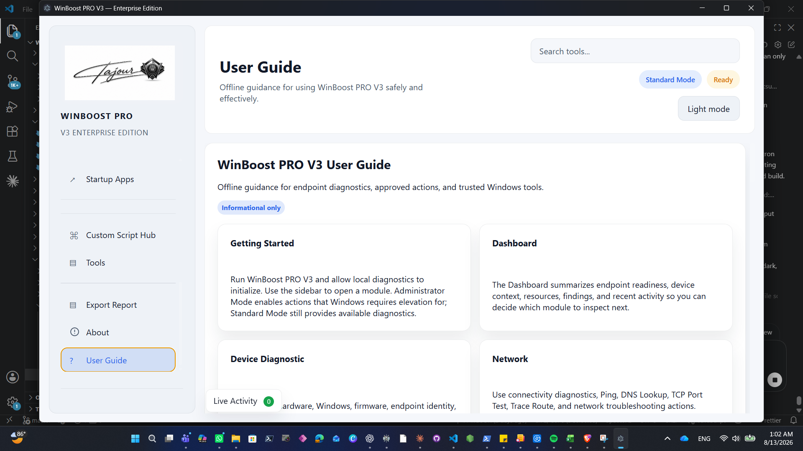
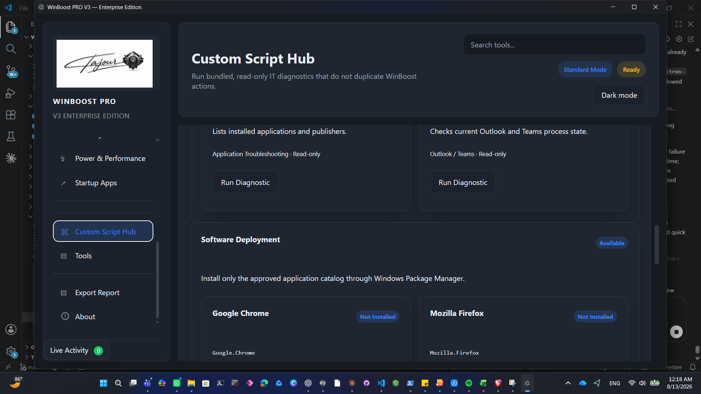
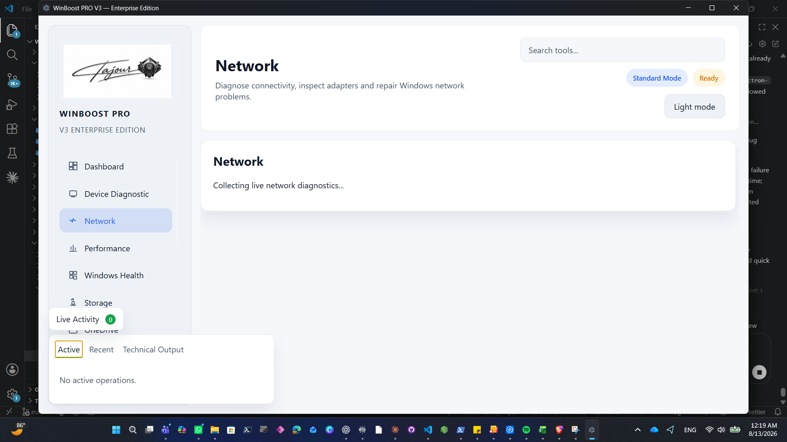
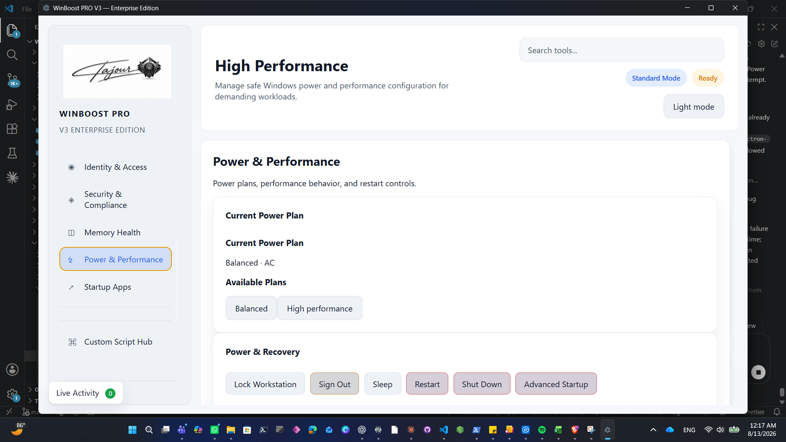

# WinBoost PRO V3 Enterprise

> Enterprise Windows Diagnostics, Troubleshooting & IT Support Toolkit

Developed by Ahmed Mostafa Abdelbaky Ayyad (Tigoor) · Windows · Portable · v3.0.1 · Unsigned build

WinBoost PRO V3 Enterprise is a Windows IT troubleshooting application by Tigoor, developed by Ahmed Mostafa Abdelbaky Ayyad. It brings commonly needed endpoint diagnostics, approved remediation workflows, trusted Windows utilities, and support evidence into one focused desktop experience.

## Why WinBoost

Windows support work often requires moving among system tools, diagnostics, service checks, and locally approved scripts. WinBoost provides a structured, safety-conscious workspace for those tasks while preserving clear activity history and technical output.

## Features

- Dashboard, Device Diagnostic, Network, Performance, Windows Health, Storage, OneDrive, Identity & Access, Security & Compliance, Memory Health, Power & Performance, and Startup Apps.
- Approved, read-only Custom Script Hub diagnostics for Group Policy, drives, printers, drivers, Microsoft 365 Apps, profiles, installed applications, and Outlook/Teams processes.
- Allow-listed WinGet Software Deployment for Google Chrome, Mozilla Firefox, 7-Zip, Visual Studio Code, Notepad++, VLC media player, Microsoft Teams, and Microsoft PowerToys.
- Fixed trusted Windows launchers, Live Activity with Active/Recent/Technical Output views, HTML/Excel/CSV reports, and built-in offline User Guide.
- Light and dark themes.

## Platform and portable use

WinBoost PRO V3 Enterprise supports Windows x64. Download the Portable EXE from a GitHub Release, verify its SHA-256 checksum, and run it. No installer is required. Use **Administrator Mode** when Windows requires elevation; available diagnostics can still run in Standard Mode.

```powershell
Get-FileHash .\WinBoost-PRO-V3-Enterprise-v3.0.1-Windows-x64-Portable.exe -Algorithm SHA256
```

Compare the result with `SHA256SUMS.txt` from the same release.

## Screenshots

The curated product screenshots below were reviewed for public distribution.









## Security and hardening

The hardened Portable uses ASAR packaging, conservative first-party JavaScript obfuscation, a minified PowerShell backend, SHA-256 runtime resource manifest, and backend integrity verification. It contains no embedded secrets or source maps. The v3.0.1 candidate is currently **unsigned**; Windows may show Unknown Publisher or SmartScreen warnings.

## Documentation

- [User Guide](docs/USER-GUIDE.md)
- [Release notes](docs/RELEASE-NOTES-v3.0.1.md)
- [Changelog](CHANGELOG.md)

## Validation

The v3.0.1 unsigned candidate passed Core 128/128, Renderer 30/30, Native Electron 2/2, Full bounded QA 13/13, Portable full-safe 12/12, Script Hub fixtures 8/8, PowerShell parser 36/36, and Node syntax 28/28. Authoritative coverage reports 101 controls, 65 SAFE_AUTO, 36 MANUAL_ONLY, and zero automated failures, uncovered controls, duplicate IDs, stale records, or missing activity mappings.

## Version and release policy

Releases use semantic versioning. A published release binary is immutable; replacement builds receive a new version and checksum. Future documentation and release assets will be published through GitHub Releases.

## System requirements

Windows x64 with the Windows capabilities required by the selected diagnostic or trusted tool. Some actions require Administrator Mode.

## Security reporting

See [SECURITY.md](SECURITY.md) for responsible vulnerability reporting and release verification guidance.

## Roadmap

- Publish signed releases once trusted code-signing credentials are available.
- Evaluate controlled update notifications backed by GitHub Releases.
- Continue expanding validated endpoint-support workflows.

## Disclaimer

Use WinBoost only on devices you are authorized to administer. Review confirmations and technical output before disruptive actions. WinBoost does not replace endpoint security, backup, or organizational change-control processes.

## License

No public-source license has been selected yet. Do not assume open-source rights. See the repository release and licensing decision before redistribution or reuse.
